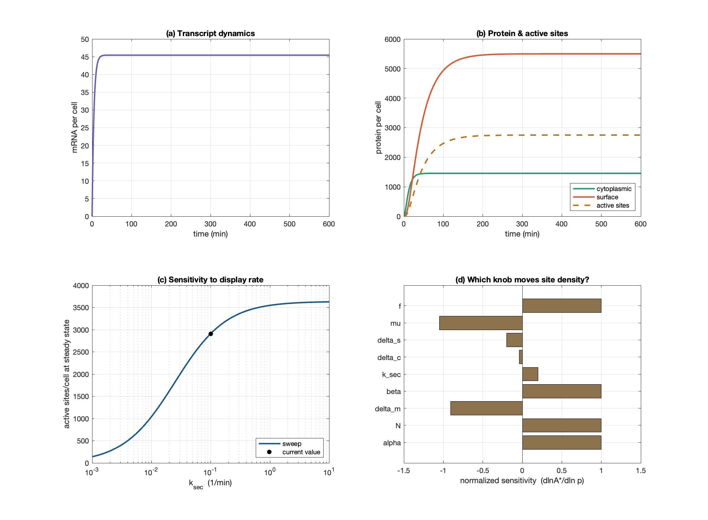
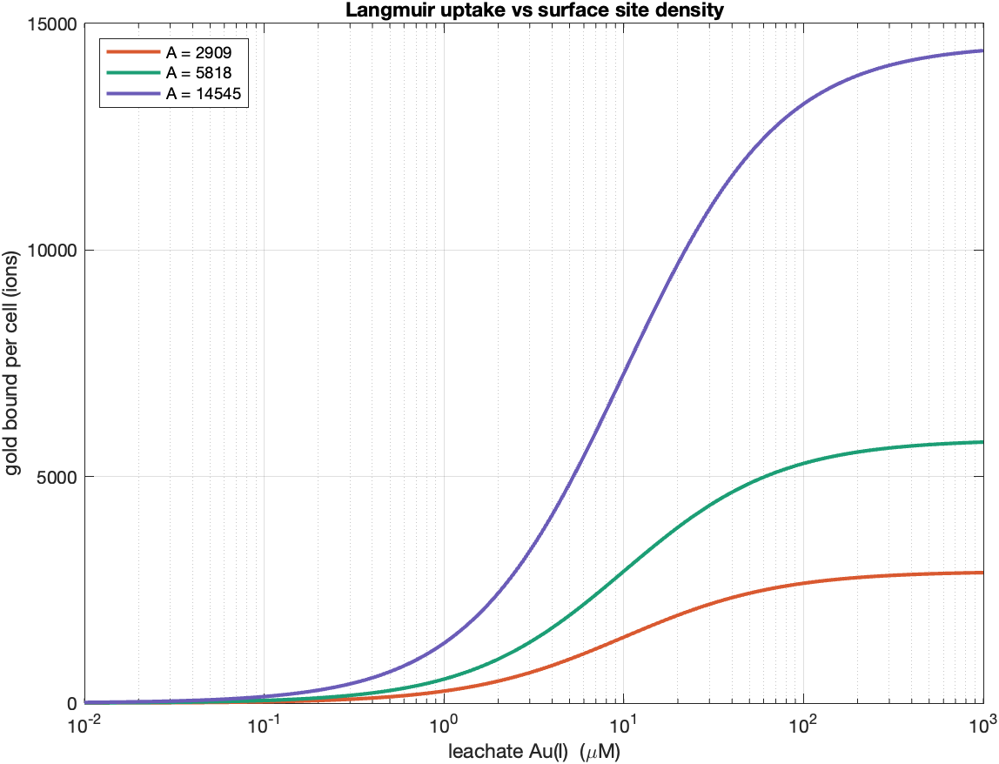

# About this document

This is a compilation of three modelling documents that together describe one
process chain, from crushed printed circuit boards to recovered metallic gold.

**The three source documents are reproduced verbatim.** Nothing has been
deleted, reworded, corrected, or renumbered. Where the sources disagree with
each other, or contain an apparent error, the disagreement is recorded in
[ISSUES.md](ISSUES.md) and left standing in the text.

| Part | Source file | Stage of the chain |
|---|---|---|
| I | `Bioleaching Models.docx` | Leaching — PCB → dissolved Au(S₂O₃)₂³⁻ |
| II | `GolB_model_writeup.docx` | Expression — GolB surface site density |
| III | `model.md` v3.0 | Capture → elution → reduction → recovery |

Pristine copies of all three originals are kept in `docs/source/`.

## The chain

```
  crushed PCB
      │
      │  PART I — Bioleaching (TetH → thiosulfate → Au/Cu leaching)
      ▼
  leachate:  [Au(S2O3)2 3-],  [Cu(I)],  [Cu(II)],  [S2O3 2-]
      │
      │  ══ JOINT 1 ══  Au_feed
      ▼
  PART III §2 — V1 capture on GolB-displaying E. coli
      ▲
      │  ══ JOINT 2 ══  q_max
      │
  PART II — GolB expression cascade (mRNA → Pc → Ps → active sites A)

  PART III continues:  capture → elution → reduction → recovery → eta_total
```

## The two joints

The three models are not three separate topics. Two named quantities connect
them, and each is a quantity that one document declares missing and another
document supplies.

**Joint 1 — `Au_feed`.**
Part III §10 states: *"`Au_feed` has no upstream model though it dominates
V1."* Part I computes exactly that quantity as `[Au(S₂O₃)₂³⁻](t)`.
Adapter: `src/interfaces.py :: au_feed_from_leach`.

**Joint 2 — `q_max`.**
Part III §9 ranks `q_max` as measurement priority 2 and notes it is *"being
addressed by the secretion model."* Part II §5 computes the active-site count
`A*` per cell, which converts to `q_max` in µM/(g/L).
Adapter: `src/interfaces.py :: qmax_from_expression`.

## Unit systems in use

The three documents were written in different unit systems. They are **not**
harmonised in the text below. Conversion happens once, inside the adapters.

| Part | Concentration | Time | Amount |
|---|---|---|---|
| I — Bioleaching | µmol L⁻¹ | minutes | µmol, mol |
| II — Expression | molecules/cell | minutes | molecules |
| III — Recovery chain | µM | hours | µM, g/L |

Note that µmol L⁻¹ and µM are the same unit under two names. Time is not the
same: Part I and Part II are per-minute, Part III is per-hour.

## Validation status

Part III §0 opens with a statement that governs the whole compilation:

> No part of this model has been checked against a measurement of this system.

That statement was written about Part III. It applies at least as strongly to
Parts I and II, whose parameter tables carry the entries *calibrate*,
*unmeasured*, *fitted*, *assumed*, and *placeholder*.

---


# Part I — Bioleaching Model

*Source: `Bioleaching Models.docx`. Reproduced verbatim.*

---

# Bioleaching Modelling --- Process Overview

Bacteria express tetrathionate hydrolase (TetH), which breaks
tetrathionate down into thiosulfate. The thiosulfate then leaches gold
(and, unavoidably, copper) from crushed PCB particles. The chain of
models is:

- Enzyme production rate

- Tetrathionate consumption rate

- Thiosulfate production rate (with Cu(II) coupling)

- Gold leaching rate --- Model A (oxygen only) and Model B (oxygen +
  Cu(II))

- Copper leaching rate and the Cu(I)/Cu(II) balance

- pH change (to be built)

## Enzyme Production

Bacteria produce tetrathionate hydrolase (TetH), which hydrolyses
tetrathionate to thiosulfate.^\[1\]^

**Reaction**

bacteria → TetH enzyme (E)

**Model**

Enzyme concentration is governed by three processes --- production
(proportional to biomass), first-order degradation, and dilution as the
cells grow ^\[3\]^:

$$\frac{d\lbrack E\rbrack}{dt} = \ k_{syn} \cdot X\ \  - \ \ (k_{\deg} + \mu) \cdot E$$

At steady state, \[E\]ₛₛ = k_syn·X / (k_deg + μ), reached over a
characteristic time of 1/(k_deg+μ) ^\[3\]^. Under the fixed-biomass
assumption (no growth), μ = 0.

**Parameters**

  ------------- ---------------------------- --------------- ------------
   **Symbol**           **Meaning**             **Unit**      **Value /
                                                               source**

      \[E\]      Active TetH concentration      µmol L⁻¹        state
                                                               variable

        t                   Time                   min           ---

        X          Biomass concentration        cell L⁻¹       input /
                                                               measured

      k_syn      Enzyme synthesis rate per     µmol cell⁻¹    calibrate
                            cell                  min⁻¹      

      k_deg       Enzyme degradation rate         min⁻¹       ≈1.1×10⁻³
                                                                \[4\]

        Μ           Growth-dilution rate          min⁻¹        0 if no
                      (=ln2/t_double)                        growth \[3\]
  ------------- ---------------------------- --------------- ------------

## Tetrathionate Consumption

**Reactions**

TetH hydrolyses tetrathionate via a disulfane-monosulfonic-acid (DSMSA)
intermediate ^\[1\]^:

S₄O₆²⁻ + H₂O → HS₂SO₃⁻ + HSO₄⁻

HS₂SO₃⁻ → S₂O₃²⁻ + S⁰ + H⁺

Lumped into a single overall reaction:

S₄O₆²⁻ + H₂O → S₂O₃²⁻ + S⁰ + SO₄²⁻ + 2H⁺

Copper(II) leached from the PCB re-oxidises thiosulfate back to
tetrathionate, so a regeneration term is required ^\[6\]\[7\]^:

2Cu(II) + 2S₂O₃²⁻ → 2Cu(I) + S₄O₆²⁻

**Model**

Consumption follows irreversible Michaelis--Menten kinetics ^\[5\]^; the
parasitic reaction above adds tetrathionate back:

$$\frac{d\left\lbrack S_{4}O_{6}^{2 -} \right\rbrack}{dt} = \ F_{in} - \frac{k_{cat} \cdot E \cdot \left\lbrack S_{4}O_{6}^{2 -} \right\rbrack}{K_{m} + \ \left\lbrack S_{4}O_{6}^{2 -} \right\rbrack} + \ k₁ \cdot \lbrack Cu(II)\rbrack \cdot \lbrack S₂O₃²⁻\rbrack$$

**Parameters**

  ------------- ---------------------------- --------------- ------------
   **Symbol**           **Meaning**             **Unit**      **Value /
                                                               source**

   \[S₄O₆²⁻\]   Tetrathionate concentration     µmol L⁻¹        state
                                                               variable

      F_in        Tetrathionate feed rate    µmol L⁻¹ min⁻¹   operating
                                                                choice

      k_cat       Turnover number of TetH         min⁻¹       unmeasured
                                                                 ---
                                                              calibrate
                                                                \[1\]

       K_m           Michaelis constant         µmol L⁻¹       50--2400
                                                                \[2\]

        E        Active TetH concentration      µmol L⁻¹     from Section
                                                                  1

       k₁                Parasitic           L µmol⁻¹ min⁻¹  calibrate (↑
                  Cu(II)--thiosulfate rate                     w/o NH₃)
                          constant                            \[6\]\[7\]

   \[Cu(II)\]     Copper(II) concentration      µmol L⁻¹     from Section
                                                                  5
  ------------- ---------------------------- --------------- ------------

# Thiosulfate Production

Thiosulfate is produced as a stoichiometric multiple (Y) of
tetrathionate consumed.

$$d\frac{\left\lbrack S_{2}O_{3}^{2 -} \right\rbrack}{dt} = \frac{k_{cat} \cdot E \cdot \left\lbrack S_{4}O_{6}^{2 -} \right\rbrack}{K_{m} + \ \left\lbrack S_{4}O_{6}^{2 -} \right\rbrack}\ \lbrack production\ only\rbrack$$

Adding the parasitic loss to Cu(II) (2 thiosulfate consumed per reaction
extent) and the loss to gold leaching gives the full balance:

$\frac{d\left\lbrack S_{2}O_{3}^{2 -} \right\rbrack}{dt}$
$\  = \frac{k_{cat} \cdot E \cdot \left\lbrack S_{4}O_{6}^{2 -} \right\rbrack}{K_{m} + \left\lbrack S_{4}O_{6}^{2 -} \right\rbrack} - 2 \cdot k_{1} \cdot \left\lbrack Cu(II) \right\rbrack \cdot \left\lbrack S_{2}O_{3}^{2 -} \right\rbrack - \left( \frac{2}{V} \right) \cdot R_{Au} - \left( \frac{1}{V} \right) \cdot R_{Cu}$

where R_Au is the gold-leaching rate (µmol min⁻¹) and R_Cu is the
copper-leaching rate (µmol min⁻¹) from Sections 4 and 5. Each gold atom
consumes 2 thiosulfate, and, depending on the oxidant, each copper atom
consumes 2 or 4 thiosulfate. The 1/V converts the surface rate to a
concentration rate.

**Parameters**

  ------------- ---------------------------- ----------------- ------------
   **Symbol**           **Meaning**              **Unit**       **Value /
                                                                 source**

   \[S₂O₃²⁻\]    Thiosulfate concentration       µmol L⁻¹         state
                                                                 variable

        Y        Stoichiometric yield (S₂O₃         ---          1 \[1\]
                         per S₄O₆)            (dimensionless)  

        V              Reactor volume                L          operating
                                                                  choice

      R_Au           Gold leaching rate         µmol min⁻¹     from Section
                                                                    4

      R_Cu          Copper leaching rate        µmol min⁻¹     From Section
                                                                    5
  ------------- ---------------------------- ----------------- ------------

# Gold Leaching

**Reactions**

Metallic gold is oxidised and complexed by thiosulfate. The oxidation
and complexation happen in a single surface step (free Au⁺ does not
persist in solution) ^\[8\]^:

Au⁰ + 2S₂O₃²⁻ → Au(S₂O₃)₂³⁻ + e⁻ (anodic half-reaction)

With oxygen as the terminal oxidant, the overall reaction is:

4Au⁰ + 8S₂O₃²⁻ + O₂ + 2H₂O → 4Au(S₂O₃)₂³⁻ + 4OH⁻

Because copper is leached from the PCB, a second, faster pathway exists
in which Cu(II) is the oxidant ^\[11\]\[12\]^:

Au⁰ + 2S₂O₃²⁻ + Cu(II) → Au(S₂O₃)₂³⁻ + Cu(I)

**Gold Surface-Area Equation**

Gold on a PCB is a thin plated film, not a bulk particle, so it
dissolves by thinning at roughly constant face area until it is
exhausted (it does not shrink inward). The exposed area is fixed by the
gold mass and plating thickness, independent of how finely the board is
crushed:

$$A_{Au}\  = \frac{m_{Au}}{\rho_{Au}\  \cdot \ t_{film}}$$

$A_{Au}\ (t)\  \approx \ A_{Au}(0)\ \$while gold remains, → 0 once
exhausted

Derivation: a film of area A and thickness t has volume A·t = m/ρ, so A
= m/(ρ·t).

### Model A --- Oxygen only (conservative)

Starting from simple mass action, gold leaching depends on oxygen
(oxidant) and thiosulfate (ligand). Because gold sits on the particle
surface, the rate scales with a time-dependent gold area --- a
shrinking-surface variant of the shrinking-core model

Since the surface has a finite number of reaction sites, each reactant
enters through a saturating (Langmuir) term ^\[8\]\[10\]^. Tracking
solid gold in mol and dissolved gold as a concentration:

$$R_{Au}\  = \ k_{Au},O_{2} \cdot \ A_{Au}(t) \cdot \frac{\left\lbrack O_{2} \right\rbrack}{K_{O_{2}} + \left\lbrack O_{2} \right\rbrack}\  \cdot \frac{\left\lbrack S_{2}O_{3}^{2 -} \right\rbrack}{K_{S} + \left\lbrack S_{2}O_{3}^{2 -} \right\rbrack}$$

$$\frac{dn_{Au}}{dt} = \  - \ R_{Au}$$

$$\frac{d\left\lbrack Au\left( S_{2}O_{3} \right)_{2}^{3 -} \right\rbrack}{dt} = + \frac{R_{Au}}{V}$$

### Model B --- Oxygen + Copper(II) (realistic)

Cu(II) provides a parallel oxidant pathway. Parallel pathways add
(either oxidant alone can dissolve gold), while area, thiosulfate, and
passivation multiply everything (all are required regardless of
oxidant). Oxygen enters only its own term --- Cu(II) does not need O₂ at
the gold surface ^\[15\]^:

$$R_{Au}\  = \ A_{Au}(t) \cdot \frac{\left\lbrack S_{2}O_{3}^{2 -} \right\rbrack}{K_{S} + \left\lbrack S_{2}O_{3}^{2 -} \right\rbrack}\ \  \cdot \ \{ k_{Au,O_{2}} \cdot \frac{\left\lbrack O_{2} \right\rbrack}{K_{O_{2}} + \left\lbrack O_{2} \right\rbrack}\  + \ k_{Au,Cu} \cdot \frac{\left\lbrack Cu(II) \right\rbrack}{K_{Cu} + \left\lbrack Cu(II) \right\rbrack}\ \}$$

$$\frac{dn_{Au}}{dt}\  = \  - R_{Au}$$

$$\ \ \ \ \ \ \ \ d\frac{\left\lbrack AuO_{3}^{3 -} \right\rbrack}{dt}\  = \  + \frac{R_{Au}}{V}$$

**Parameters**

  ----------------- ---------------------------- --------------- --------------
     **Symbol**             **Meaning**             **Unit**       **Value /
                                                                    Source**

        n_Au            Solid gold remaining      mol (or µmol)  state variable

   \[Au(S₂O₃)₂³⁻\]     Dissolved gold complex       µmol L⁻¹     state variable
                             (product)                           

        A_Au            Exposed gold area =            m²        from geometry
                         m_Au/(ρ_Au·t_film)                      

        ρ_Au                Gold density             kg m⁻³          19300

       t_film          Gold plating thickness           M        0.05--1 ×10⁻⁶
                                                                  (board spec)

       k_Au,O₂      Gold rate constant, O₂ route µmol m⁻² min⁻¹  ≈11 (1.9×10⁻⁷
                                                                  mol m⁻²s⁻¹)
                                                                  \[9\]\[10\]

       k_Au,Cu       Gold rate constant, Cu(II)  µmol m⁻² min⁻¹   ≈10³× larger
                               route                              \[11\]\[12\]

        K_O₂             O₂ half-saturation         µmol L⁻¹       calibrate
                                                                     (\~50)

         K_S        Thiosulfate half-saturation     µmol L⁻¹       calibrate
                                                                   (\~5×10⁴)

        K_Cu           Cu(II) half-saturation       µmol L⁻¹       Calibrate
  ----------------- ---------------------------- --------------- --------------

## Copper Leaching and the Cu(I)/Cu(II) Balance

**Reactions**

Metallic copper dissolves as Cu(I)--thiosulfate. Two oxidant pathways
exist ^\[13\]\[7\]^:

With oxygen as oxidant:

4Cu⁰ + O₂ + 8S₂O₃²⁻ + 2H₂O → 4\[Cu(S₂O₃)₂\]³⁻ + 4OH⁻

With Cu(II) as oxidant (comproportionating one Cu(II) plus one Cu⁰ gives
two Cu(I)):

Cu⁰ + Cu²⁺ → 2Cu⁺

Cu⁺ + 2S₂O₃²⁻ → \[Cu(S₂O₃)₂\]³⁻

Cu⁰ + Cu²⁺ + 4S₂O₃²⁻ → 2\[Cu(S₂O₃)₂\]³⁻

Cu(I) is re-oxidised to Cu(II) by oxygen, and Cu(II) is reduced back to
Cu(I) by thiosulfate and by gold leaching ^\[7\]\[15\]^:

4Cu(I) + O₂ + 2H₂O → 4Cu(II) + 4OH⁻

2Cu(II) + 2S₂O₃²⁻ → 2Cu(I) + S₄O₆²⁻

Au⁰ + 2S₂O₃²⁻ + Cu(II) → Au(S₂O₃)₂³⁻ + Cu(I)

**Copper Surface-Area Equation**

Copper is bulk metal (traces, planes, inner layers), so its particles
genuinely erode inward --- a true shrinking-particle geometry

The initial area follows the surface-to-volume ratio 6/d for crushed
particles of size d; as copper is consumed, the area falls as the
two-thirds power of the fraction remaining (area ∝ r², volume ∝ r³)
^\[14\]^:

$$A_{Cu}(0) = \ 6 \cdot \frac{m_{Cu}}{(\rho_{Cu}\  \cdot \ d)}$$

$$A_{Cu}(t)\  = \ A_{Cu}(0)\  \cdot \ \left( \frac{n_{Cu}}{n_{Cu}(0)} \right)^{\frac{2}{3}}$$

**Rates**

Copper leaching, oxygen route (v₁A) and combined-oxidant route (v₁B);
gold-leaching Cu(I) return (v₂); parasitic tetrathionate regeneration
(v₃); Cu(I) re-oxidation by oxygen (v₄):

$$v_{1A}\  = \ {2k}_{Cu,O_{2}} \cdot A_{Cu}(t) \cdot \frac{\left\lbrack O_{2} \right\rbrack}{K_{O_{2}} + \left\lbrack O_{2} \right\rbrack} \cdot \frac{\left\lbrack S_{2}O_{3}^{2 -} \right\rbrack}{K_{S} + \left\lbrack S_{2}O_{3}^{2 -} \right\rbrack}\ $$

$$v_{1B}\  = \ A_{Cu}(t) \cdot \frac{\left\lbrack S_{2}O_{3}^{2 -} \right\rbrack}{K_{S} + \left\lbrack S_{2}O_{3}^{2 -} \right\rbrack} \cdot \{\ {2k}_{Cu,O_{2}} \cdot \frac{\left\lbrack O_{2} \right\rbrack}{K_{O_{2}} + \left\lbrack O_{2} \right\rbrack}\  + \ {4k}_{Cu,\ \ Cu^{2 +}} \cdot \frac{\left\lbrack Cu(II) \right\rbrack}{K_{Cu} + \left\lbrack Cu(II) \right\rbrack}\ \}\ $$

$$v₂\  = \ R_{Au}\ \ (gold - leaching\ rate,\ Section\ 4)$$

$$v₃\  = \ k₃ \cdot \lbrack Cu(II)\rbrack \cdot \lbrack S₂O₃²⁻\rbrack$$

$$v₄\  = \ k₄ \cdot \lbrack O₂\rbrack \cdot \lbrack Cu(I)\rbrack$$

**Cu(I) model**

Cu(I) is produced by copper leaching, by gold leaching, and by the
parasitic reaction, and is consumed by oxygen re-oxidation. Reading
coefficients off the balanced reactions (comproportionating gives 2
Cu(I) per extent; parasitic gives 2 Cu(I) per extent; O₂ re-oxidation
consumes 4 Cu(I) per extent):

$$\frac{d\left\lbrack Cu(I) \right\rbrack}{dt}\  = \ \left( \frac{1}{V} \right) \cdot 2 \cdot v₁B\  + \ \left( \frac{1}{V} \right) \cdot v₂\  + \ 2 \cdot v₃\  - \ 4 \cdot v₄$$

**Cu(II) model**

Cu(II) is produced only by oxygen re-oxidation of Cu(I), and consumed by
the comproportionating leach, the parasitic reaction, and gold leaching:

$$d\frac{\left\lbrack Cu(II) \right\rbrack}{dt}\  = \ 4 \cdot v₄\  - \ \left( \frac{1}{V} \right) \cdot v₁B\  - \ \left( \frac{1}{V} \right) \cdot v₂\  - \ 2 \cdot v₃$$

**Parameters**

  ------------- ---------------------------- --------------- ------------
   **Symbol**           **Meaning**             **Unit**      **Value /
                                                               source**

    \[Cu(I)\]     Copper(I) concentration       µmol L⁻¹        state
                    (cannot leach gold)                        variable

   \[Cu(II)\]     Copper(II) concentration      µmol L⁻¹        state
                       (gold oxidant)                          variable

      n_Cu         Solid copper remaining          mol          state
                                                               variable

      A_Cu         Exposed copper area =           m²            from
                  6m_Cu/(ρ_Cu·d)·(n/n₀)\^⅔                     geometry

      ρ_Cu             Copper density            kg m⁻³          8960

        d          Crushed particle size            m         2--6×10⁻³
                                                             (your feed)

     k_Cu,O₂      Copper rate constant, O₂   µmol m⁻² min⁻¹   calibrate
                           route                               (Ea≈25.8
                                                               kJ/mol)
                                                                \[13\]

     k_Cu,Cu    Copper rate constant, Cu(II) µmol m⁻² min⁻¹   calibrate
                           route                             

       k₃       Parasitic (Cu(II)+S₂O₃) rate L µmol⁻¹ min⁻¹      ≈ k₁
                          constant                            \[6\]\[7\]

       k₄         Cu(I) re-oxidation rate    L µmol⁻¹ min⁻¹   calibrate
                          constant                           
  ------------- ---------------------------- --------------- ------------

# References

**\[1\]** Y. Kanao et al., \"Tetrathionate hydrolase from the
acidophilic microorganisms,\" Front. Microbiol., vol. 15, 1338669, 2024.

**\[2\]** Y. Kanao, K. Kamimura, and T. Sugio, \"Purification of a
tetrathionate hydrolase from Acidithiobacillus ferrooxidans,\" J.
Biotechnol., vol. 132, pp. 16--22, 2007.

**\[3\]** U. Alon, An Introduction to Systems Biology, 2nd ed. Boca
Raton, FL: CRC Press, 2019.

**\[4\]** M. R. Maurizi, \"Proteases and protein degradation in
Escherichia coli,\" Experientia, vol. 48, pp. 178--201, 1992.

**\[5\]** G. E. Briggs and J. B. S. Haldane, \"A note on the kinetics of
enzyme action,\" Biochem. J., vol. 19, pp. 338--339, 1925.

**\[6\]** J. J. Byerley, S. A. Fouda, and G. L. Rempel, \"Kinetics and
mechanism of the oxidation of thiosulphate ions by copper(II) ions in
aqueous ammonia solution,\" J. Chem. Soc. Dalton Trans., pp. 889--893,
1973.

**\[7\]** P. L. Breuer and M. I. Jeffrey, \"The reduction of copper(II)
and the oxidation of thiosulfate and oxysulfur anions in gold leaching
solutions,\" Hydrometallurgy, vol. 70, pp. 163--173, 2003.

**\[8\]** G. Senanayake, \"Analysis of reaction kinetics, speciation and
mechanism of gold leaching and thiosulfate oxidation by ammoniacal
copper(II) solutions,\" Hydrometallurgy, vol. 75, pp. 55--75, 2004.

**\[9\]** S. Zhang and M. J. Nicol, \"An electrochemical study of the
dissolution of gold in thiosulfate solutions Part I: Alkaline
solutions,\" J. Appl. Electrochem., vol. 33, pp. 767--775, 2003.

**\[10\]** O. Sitando et al., \"A review of factors affecting gold
leaching in non-ammoniacal thiosulfate solutions,\" Hydrometallurgy,
vol. 178, pp. 151--175, 2018.

**\[11\]** M. G. Aylmore and D. M. Muir, \"Thiosulfate leaching of gold
--- a review,\" Miner. Eng., vol. 14, no. 2, pp. 135--174, 2001.

**\[12\]** D. Maharaj, T. Moyo, and J. Petersen, \"Ammonium thiosulfate
leaching of gold from electronic printed circuit boards --- effect of
solution copper concentration,\" J. S. Afr. Inst. Min. Metall., vol.
124, no. 12, pp. 711--718, 2024.

**\[13\]** E. Salinas-Rodríguez et al., \"Leaching of copper contained
in waste printed circuit boards using the thiosulfate--oxygen system: a
kinetic approach,\" Materials, vol. 15, no. 7, 2354, 2022.

**\[14\]** O. Levenspiel, Chemical Reaction Engineering, 3rd ed. New
York, NY: Wiley, 1999.

**\[15\]** P. L. Breuer and M. I. Jeffrey, \"The effect of ionic
strength and buffer choice on the decomposition of tetrathionate; and
the role of copper(II) as oxidant in gold thiosulfate leaching,\"
Hydrometallurgy, vol. 65, pp. 145--157, 2002.


---

# Part II — GolB Surface Site Density Model

*Source: `GolB_model_writeup.docx`. Reproduced verbatim; figure paths repointed to `docs/media/`.*

---

**Modeling Surface Site Density for GolB-Based Gold Biosorption**

# 1. Purpose and scope

Our project recovers gold from electronic waste in two stages:
bioleaching mobilizes gold from the waste into a leachate, and
biosorption then captures the dissolved gold using engineered bacteria.
For biosorption we display the gold-binding protein GolB on the cell
surface, so that gold ions in the leachate bind directly to accessible
protein rather than having to enter the cell. The quantity that
determines how much gold a single cell can capture is the surface site
density --- the number of active, gold-accessible GolB molecules on the
outer membrane.

This model predicts that surface site density from first principles,
tracing the gene-expression cascade that produces it: transcription of
the GolB gene into mRNA, translation into cytoplasmic protein, export
and anchoring of that protein at the surface, and finally the fraction
of surface protein that is correctly folded and able to bind gold.
Because our team works from published data rather than our own
measurements, every parameter is a literature-grounded estimate, and the
two parameters that cannot be read directly from the literature are
treated as explicitly fitted values.

# 2. Model structure

We represent the system as four connected pools, expressed as molecules
per cell. Each pool is fed by the process upstream of it and drained by
degradation and by dilution as the cell grows and divides:

mRNA *m* → cytoplasmic protein *P*~c~ → surface-displayed protein *P*~s~
→ active sites *A*

Dilution appears because a growing cell continually doubles its volume;
even a perfectly stable protein is diluted at the growth rate. For
fast-turnover species such as mRNA this term is small, but for stable
proteins it is often the dominant loss.

# 3. Governing equations

The cascade is written as a system of ordinary differential equations.
Transcription produces mRNA at a rate set by promoter strength and copy
number, and mRNA is lost to degradation and dilution:

d*m*/d*t* = *α*·*N* − (*δ*~m~ + *μ*)·*m*

Translation converts each mRNA into protein; the cytoplasmic pool is
drained by export to the surface, by degradation, and by dilution:

d*P*~c~/d*t* = *β*·*m* − (*k_sec* + *δ*~c~ + *μ*)·*P*~c~

Export anchors protein at the surface. Because the membrane holds a
finite number of anchors, the arrival term saturates as the surface
fills toward its capacity:

d*P*~s~/d*t* = *k_sec*·*P*~c~·(1 − *P*~s~/*P*~s,max~) − (*δ*~s~ +
*μ*)·*P*~s~

Finally, only a fraction of the displayed protein is correctly folded
and gold-accessible, so the number of active binding sites is:

*A* = *f*·*P*~s~

# 4. Parameters

The table below lists every parameter, the value used in the simulation,
and its basis in the literature. The central-dogma constants are
standard order-of-magnitude values for Escherichia coli. The surface
capacity comes from characterized autodisplay systems. Two parameters
--- the display rate k_sec and the functional fraction f --- depend on
the specific construct and are treated as fitted; the gold dissociation
constant K_d is a placeholder because no clean experimental value for
GolB has been reported.

  ------------------------------------------------------------------------------------------------
  **Symbol**   **Meaning**             **Value**   **Units**              **Basis / source**
  ------------ ----------------------- ----------- ---------------------- ------------------------
  α            Transcription rate per  0.5         mRNA·min⁻¹·copy⁻¹      Typical E. coli promoter
               plasmid copy (promoter                                     output (BioNumbers)
               strength)                                                  

  N            Plasmid copy number     20          copies/cell            Medium-copy backbone,
                                                                          pBR322-like (≈15--20)

  δₘ           mRNA degradation rate   0.20        min⁻¹                  E. coli mRNA half-life
                                                                          ≈2--5 min (t½≈3.5 min)

  β            Translation rate per    4.0         protein·min⁻¹·mRNA⁻¹   Typical E. coli
               mRNA (RBS strength)                                        translation efficiency
                                                                          (BioNumbers)

  k_sec        Export /                0.10        min⁻¹                  Set by the display
               surface-display rate                                       scaffold; fitted
               constant                                                   parameter

  δ_c          Cytoplasmic protein     0.005       min⁻¹                  ≈0 for a stable protein
               degradation                                                

  δ_s          Surface protein loss    0.005       min⁻¹                  Assumed
                                                                          dilution-dominated

  μ            Growth (dilution) rate  0.02        min⁻¹                  Doubling time ≈35 min (μ
                                                                          = ln2 / t_double)

  f            Fraction folded +       0.5         --                     Folding/accessibility;
               gold-accessible                                            fitted parameter

  P_s,max      Maximum surface anchor  1×10⁵       sites/cell             Autodisplay reaches
               sites                                                      \>10⁵ molecules/cell
                                                                          (Jose & Meyer)

  K_d          GolB--Au(I)             10          µM                     Placeholder -- no clean
               dissociation constant                                      experimental K_d; source
                                                                          or fit
  ------------------------------------------------------------------------------------------------

# 5. Steady-state site density

Setting the time derivatives to zero and substituting down the cascade
gives closed-form steady-state values (in the non-saturating limit,
valid whenever site density stays well below capacity, which holds
here):

*m*~\*~ = *αN* / (*δ*~m~ + *μ*)

*P*~c\*~ = *βm*~\*~ / (*k_sec* + *δ*~c~ + *μ*)

*P*~s\*~ = *k_secP*~c\*~ / (*δ*~s~ + *μ*)

Combining these yields a single expression for the quantity we care
about:

*A*~\*~ = *f·α·N·β·k_sec* / \[(*δ*~m~ + *μ*)(*k_sec* + *δ*~c~ +
*μ*)(*δ*~s~ + *μ*)\]

This makes the design logic explicit: site density scales linearly with
promoter strength, copy number, and translation strength, while the
secretion rate partitions protein between the cytoplasm and the surface.
With the parameters above, the model gives roughly 45 mRNA, 1,460
cytoplasmic protein, 5,500 surface protein, and about 2,900 active sites
per cell.

# 6. Coupling to gold uptake

The active-site count feeds a Langmuir adsorption isotherm that predicts
how much gold a cell binds at a given leachate concentration *C*.
Because GolB binds Au(I) through a single Cys-X-X-Cys motif, each site
captures one gold ion, so the maximum uptake equals the site count *A*:

*q*(*C*) = *A*·*C* / (*K*~d~ + *C*)

This is the bridge between the expression model and the actual
objective: whatever raises the active-site count raises the recovery
ceiling proportionally.

# 7. Simulation results

Figure 1 shows the model run to steady state and two analyses derived
from it.

{width="6.5in"
height="4.770833333333333in"}

*Figure 1. (a) Transcript dynamics; (b) protein and active-site
dynamics; (c) steady-state site density versus display rate; (d)
normalized parameter sensitivity of the steady-state site density.*

**Panel (a) --- Transcript dynamics.** mRNA reaches steady state (about
45 copies per cell) within roughly 20--30 minutes. This is fast because
mRNA turns over quickly; a species equilibrates on the timescale of a
few of its own half-lives, and mRNA half-life is only a few minutes.

**Panel (b) --- Protein and active sites.** The cytoplasmic pool
(≈1,460), the surface pool (≈5,500), and the active sites (≈2,900, being
half the surface pool) rise much more slowly, taking around 150--200
minutes to plateau. The slowness comes from the protein loss being
dominated by dilution, which is far slower than mRNA turnover. Notably
the surface pool exceeds the cytoplasmic pool: export continuously
drains the cytoplasm, whereas the surface pool is lost only to slow
dilution, so displayed protein accumulates.

**Panel (c) --- Sensitivity to display rate.** Steady-state site density
is plotted against the export rate k_sec on a logarithmic axis, giving
an S-shaped curve. When export is slow, protein remains trapped in the
cytoplasm and few sites form. As export speeds up, more protein reaches
the surface, but above roughly 1 min⁻¹ the curve flattens near 3,600
sites because transcription and translation, not export, now set the
ceiling. The marked point is the operating value used (0.1 min⁻¹). The
practical message is that simply making secretion faster yields
diminishing returns.

**Panel (d) --- Which parameter moves site density.** Each bar is a
normalized sensitivity: the fractional change in steady-state site
density per fractional change in that parameter. Promoter strength (α),
copy number (N), translation strength (β), and functional fraction (f)
all sit near +1, meaning a 1% increase in any of them gives about a 1%
increase in sites --- these are the highest-leverage engineering
handles. The export rate k_sec is only about +0.2 (sublinear, because it
appears in both the numerator and a denominator), confirming the
diminishing returns seen in panel (c). Growth rate (μ) is the strongest
negative influence because it appears in all three loss terms, and mRNA
degradation (δₘ) is also strongly negative; cytoplasmic and surface
degradation matter little at these values.

Figure 2 translates site density into predicted gold capture.

{width="5.416666666666667in"
height="4.145833333333333in"}

*Figure 2. Langmuir uptake curves for three engineered site densities
(base, 2×, and 5×), showing gold ions bound per cell as a function of
leachate Au(I) concentration.*

Each curve rises with leachate gold concentration and plateaus at its
own site density --- the plateau is simply the number of sites, since
each binds one ion. The three curves correspond to the base design
(≈2,900 sites) and to two- and five-fold improvements. Half-saturation
occurs at a concentration equal to *K*~d~ (10 µM here), and above
roughly 100 µM every design is near saturation. The key takeaway is that
at any fixed leachate concentration, gold captured scales directly with
engineered site density, so the expression-level improvements identified
in Figure 1 carry straight through to recovery capacity.

# 8. Assumptions and limitations

The model is deterministic and describes an average cell, so it does not
capture cell-to-cell variability. Expression is treated as constant and
constitutive; induction timing, resource competition, and the growth
burden of heavy membrane-protein overexpression are not included. The
drain on the cytoplasmic pool is kept first-order so that a closed-form
steady state exists, with saturation applied only to surface arrival;
this is accurate while site density stays well below capacity, which is
the case here (thousands of sites against a ceiling of 10⁵). Finally,
the parameters are literature order-of-magnitude estimates rather than
measurements of our exact construct, and the gold dissociation constant
in particular is a placeholder that should be sourced from a biosorption
isotherm or fitted.

# 9. Literature basis

**Surface-display capacity.** Jose J, Meyer TF. Autodisplay: efficient
bacterial surface display of recombinant proteins. Applied Microbiology
and Biotechnology (2006) --- reports more than 10⁵ recombinant molecules
displayed per cell via the AIDA-I autotransporter.

**GolB structure and gold binding.** Structural Insights and the
Surprisingly Low Mechanical Stability of the Au--S Bond in the
Gold-Specific Protein GolB. Journal of the American Chemical Society
(2015) --- apo- and Au(I)-bound GolB crystal structures and the
Cys-X-X-Cys binding motif. Tolbatov I, Re N, Coletti C, Marrone A. An
Insight on the Gold(I) Affinity of golB Protein via Multilevel
Computational Approaches (2019).

**Gold sensing and the gol system.** Bacterial gold sensing and
resistance. BioMetals (2011) --- GolS/GolB selectivity for Au(I). GolS
controls the response to gold by hierarchical induction of
Salmonella-specific genes. Molecular Microbiology (2007) --- GolB as a
small cytoplasmic gold-binding protein.

**Prior GolB display precedent.** iGEM Registry part BBa_K1701000 ---
GolB displayed on the E. coli surface for selective enrichment of gold
ions from mixed-metal media (parts.igem.org).

**Central-dogma parameters.** BioNumbers database
(bionumbers.hms.harvard.edu) for E. coli mRNA half-lives, translation
rates, and growth rates.


---

# Part III — Gold Biorecovery Model v3.0

*Source: `model.md` v3.0 (2026-08-04). Reproduced verbatim.*

---

# Gold Biorecovery — Model

**v3.0 (2026-08-04)** · Code: `pipeline_model.py`, `r9L_fw.py`, `ensemble.py`
**Units:** µM, hours, g/L · **Companion:** build plan v2.5 (decisions, audit trail, citations)

*This document is current state only. Change history, superseded results and
provenance disputes live in the build plan.*

---

## 0. Validation status — read first

**No part of this model has been checked against a measurement of this system.**
Every parameter is literature-transplanted, proxy-bounded, or declared. The
verification checks confirm the code solves the equations; they say nothing
about whether the equations describe reality.

Three facts bound every claim below:

- **No demonstration exists** that this construct reduces gold in a lysate. The
  source paper used purified protein + added dithionite on pure HAuCl₄; the
  process uses crude lysate + native reductants on thiourea eluate.
- **Conversion has never been quantified** by anyone, in any version of this
  chemistry. Both source papers detect product by colour and TEM only.
- **Selectivity against Cu/Ag/Ni is unknown.** Both source papers used pure gold.

**The deliverable is a ranked measurement priority list, not a yield prediction.**

**Track record: every parameter assumed without a source, then sourced, was
wrong** — `A_tox` (wrong regime), `K_D` (≥12 orders), `k_red` (7×),
`eta_spin` (2×). `eta_wash` is the last unsourced parameter and should be
treated as an upper bound.

---

## 1. The chain

$$\eta_{total}=\eta_{capture}\cdot\eta_{elute}\cdot\eta_{reduce}\cdot\eta_{phys}$$

Two parallel arms converge at reduction:

```
ARM A (gold)                              ARM B (reagent)
  leach (out of scope) → sets Au_feed       grow E. coli BL21 + ABC construct
        ↓                                   induce 1 mM IPTG, 4 h
  V1 capture biofilm, 13-16 h               lyse: sonicate, 100,000 g 90 min
        ↓ thiourea elution, 3 h                    ↓
  conditioning (not modelled) ──────→  V2 lysate reduction, 12-24 h, pH 7.4
                                              ↓
                                       recovery: spin → wash → ash
```

**Critical path ≈ 42 h/batch.** Conditioning is the only unmodelled series step
(assumed lossless).

**Current: `eta_total` = 10.5% median, 90% CI [0.0%, 49.4%].**

---

## 2. V1 — capture

Living *E. coli* displaying GolB in an LB-like (chelating) medium.
States: `X` biomass, `C` bound gold, `D` damage.

$$A=Au_{tot}-C \qquad S_0=q_{max}X \qquad G=A+wC$$

$$\frac{dX}{dt}=\mu X\left(1-\frac{X}{X_{max}}\right)-mX-\lambda_D DX$$
$$\frac{dC}{dt}=k_{on}A(S_0-C)-k_{off}C$$
$$\frac{dD}{dt}=k_{dam}G-k_{rep}D \qquad \lambda_D=\frac{\mu k_{rep0}}{A_{tox}}$$

Lethality is pinned to a fixed value rather than scaled with repair, so slow
repair appears as harm rather than compensation.

**Verification (all pass):** Langmuir limit ($C_{eq}=S_0A/(A+K_D)$, err 2e-09);
binding half-time; gold mass balance; zero-gold logistic limit; capacity ceiling
$\eta \le q_{max}X_{max}/Au_{tot}$.

### 2.1 Two results that matter

**No harvest-time optimum exists.** In an LB-like medium at sub-onset feed,
capture is flat: 79.5% at 12 h, 79.8% at 24 h, 79.7% at 72 h. **Harvest any time
after ~12 h.** The earlier "toxicity racing binding" result was an artefact of a
buffer-regime `A_tox`.

**`Au_feed` is the dominant design variable**, and an input from the
out-of-scope leaching model:

| `Au_feed` | η (`A_tox`=250) | η (`A_tox`=30) | Au captured | limited by |
|---|---|---|---|---|
| 3 µM | 85.2% | 84.2% | 2.56 µM | equilibrium |
| 10 µM | 79.9% | 73.3% | 7.99 µM | equilibrium |
| 22 µM | 64.8% | 37.7% | 14.26 µM | ← transition |
| 50 µM | 33.7% | 4.1% | 16.84 µM (peak) | capacity |
| 300 µM | 1.6% | 0.1% | 4.70 µM | capacity |

The transition is exactly the capacity ceiling $q_{max}X_{max}$ = 22 µM.
**Absolute capture peaks near 50 µM feed** but that is where `A_tox` uncertainty
swings capture ~8×.

**Recommended operating point: 10–20 µM feed** — below the absolute peak, but
the `A_tox` disagreement costs <10% there vs 63–96% above 30 µM. **Dilution is
a legitimate design lever.**

**Capture is capacity-limited, not affinity-limited.** At 10 µM feed, sites must
exceed 10 µM, requiring X > 2.27 g/L.

---

## 3. Elution

**Mechanism: thiourea competitive ligand exchange, not acid.** One Au atom is
chelated between two sulfur atoms of two thiourea molecules — a better bidentate
site than GolB's Cys10/Cys13. Acid (pH 1.4–1.8) is a co-requirement, not the
mechanism.

⚠️ **The project architecture assumed an acid wash. If the wet lab plans
acid-only, elution may recover far less than $(1-\phi)$ predicts and the model
would not show it** — `k_max` is a fitted rate that silently absorbs "the eluent
doesn't work." **Confirm the eluent.**

Thiourea at ~1 M against micromolar gold is a ~10⁴ excess, so the exchange is
pseudo-first-order:

$$\frac{dC}{dt}=-\underbrace{k[TU]^n}_{k_{max}}\big(C-\phi C_0\big)^{+}$$

$$\boxed{\ \eta_{elute}(t_k)=(1-\phi)\left(1-e^{-k_{max}t_k}\right)\ }$$

- $(1-\phi)$ — **ceiling.** Chemistry. Not improvable by time or acid strength.
- $(1-e^{-k_{max}t_k})$ — **approach.** 95% of ceiling at $3/k_{max}$.

**Different fixes:** a short wash is cured by patience; a low ceiling is not.
Sampling at 0.5/1/2/4 h distinguishes them.

`pKa_GolB` and `n_H` leave the model — below pH 2 the thiourea route is fully
open.

**`k_max` is a design lever** since $k_{max}=k[TU]^n$: at 2 M the wash finishes
in an hour; at 0.1 M six hours is not enough.

---

## 4. Reduction (rung 9L)

Cell-free metabolic engineering with crude extract. The protein is a
**stoichiometric redox reactant, not a catalyst** — one exterior Cys337–Cys481
disulfide, 2 electrons, consumed per use.

**Crude lysate reduces gold with no added reductant** (published); only
*purified* protein needs dithionite, because purification dialyses the native
reductants out. **Do not dialyse the V2 lysate.**

States: `A` soluble Au, `E_r` fresh sites, `E_o` spent sites, `R` carried-over
reductant (finite, no regeneration), `B` Au(0).

$$v_{red}=k_{red}AE_r \qquad v_{FW}=(k_1+k_2B)A \qquad v=\min(v_{red},v_{FW})$$

$$\frac{dA}{dt}=-v \quad \frac{dB}{dt}=+v \quad
\frac{dE_r}{dt}=-\nu v+v_{rech}-k_{ox}E_r \quad \frac{dR}{dt}=-\nu_R v_{rech}$$

$$v_{rech}=k_{rech}E_o\frac{R}{1+A/K_i}$$

with $\nu=n_{e,Au}/2$: **0.5 for Au(I)** (our feed), 1.5 for Au(III).

**The slow step is nucleation, not electron transfer.** Thiol+gold redox
completes in ~100 s, but the observed process takes 8–48 h — a factor of ~300.
$k_1$ is nucleation (slow); $k_2B$ is autocatalytic growth, accelerating as
surface accumulates.

### 4.1 Electron budget — the rate-free ceiling

$$\eta_{reduce}\le\frac{2E_{tot}+2R_0}{n_{e,Au}A_0}$$

Needs no rate constant. **At 5.78 µM Au(I), 0.2 g/L protein already supplies
98.9% of the electrons needed**, so $\eta_{reduce}\approx 1$ on the budget.

The same arithmetic reproduces the source papers' regime: at 2 mM Au(III) with
0.1 g/L protein the budget covers **0.048%** — which is why they never measured
conversion.

**Regeneration does not decide the outcome.** Sweeping $k_{rech}$ over five
orders and $R_0$ over four leaves $\eta_{reduce}$ at 97.7–100%. Even with zero
regeneration, 97.7%. The carried-over reductant's real role is **buffering
against aerobic inactivation** ($k_{ox}$), not driving turnover.

**Verification (all pass):** fast-limit exponential decay (err 1.3e-09);
stoichiometric limit $B_\infty=E_{tot}/\nu$ exact; site conservation (6e-13);
gold mass balance (2e-10).

### 4.2 The testable prediction

| t (h) | 1 | 2 | 4 | **8** | **12** | 24 |
|---|---|---|---|---|---|---|
| η_reduce | 0.01% | 0.04% | 0.4% | **31%** | **98%** | 100% |

**Sigmoid with a pronounced induction period.** A non-nucleation model predicts
monotone-decelerating decay — fastest at t=0. **Opposite shapes in the first
four hours.**

**Experiment: gold + lysate, sample 0/1/2/4/8/24 h, read A₅₂₀.**

| observation | conclusion |
|---|---|
| little happens, then rapid conversion | nucleation-limited — confirmed |
| fastest at t=0, gradually slowing | electron-transfer-limited |
| never completes | budget- or reductant-limited |

⚠️ **$k_1$ and $k_2$ are calibrated against one qualitative observation**
("nanoparticles visible at 8 h"), checked only against a published gold F-W fit
via the dimensionless shape group $k_2[A]_0/k_1$ — ours 23,120 vs literature
10,685, a factor of 2.2. **They are the joint #1 driver of the pipeline and are
not measured.**

---

## 5. Recovery (rung 11)

$$\eta_{phys}=\eta_{spin}\cdot\eta_{wash}\cdot\eta_{ash}$$

**Centrifugation, not gravity settling.** Stokes ($v\propto r^2$, gold 19.3
g/cm³), time to fall 10 cm: 10 nm → 290 days; 100 nm → 3 days; 1 µm → 42 min.
Nanoparticles never settle unaided.

⚠️ **But centrifugation does not remove the size dependence.** A commercial
protocol reports **~50% recovery for 10 nm gold after a 30-minute size-matched
spin.**

| term | value | basis |
|---|---|---|
| `eta_spin` | **0.50 (10 nm) – 0.97 (>200 nm)** | sourced only at 10 nm |
| `eta_wash` | 0.95 | **unsourced — upper bound** |
| `eta_ash` | 0.98 | conditional on temperature ↓ |

**Hard process constraint: ash at 500–600 °C, do not exceed.** Biomass fully
decomposes there and gold is retained. Above it, gold partially volatilises into
the off-gas and recondenses in fine ash — in a lab furnace, on the walls.

### 5.1 The trade-off this creates

High protein → better conversion → **smaller particles** → worse recovery.
$\eta_{reduce}$ and $\eta_{phys}$ pull against each other through protein
loading. **Rung 12 must optimise their product, not each separately.**
Particle-size distribution therefore re-enters the model.

### 5.2 Purity

Core is verified metallic fcc Au(0) (XRD Bragg reflections, SAED, EDX). Every
particle carries a protein coat — the reducing protein is also the stabilising
agent. **The organic fraction has never been quantified**; the obvious EDX
measurement is confounded by the carbon TEM grid.

Purity scales with size (5 nm coat assumed): ~86% Au at 10 nm core, ~98% at
50 nm, ~99.5% at 200 nm. Calcination removes the remainder.

**Context:** the V2 output is **0.02–0.07% gold by mass** — comparable to raw
e-waste PCBs. The gain is *form* (discrete separable metal), not grade.

---

## 6. Optimisation

**Two objectives, and they conflict.** $\eta_{total}$ is a *fraction*;
maximising it starves the feed.

| `Au_feed` | $\eta_{total}$ | Au recovered |
|---|---|---|
| 3 µM | 63.1% | 1.89 µM |
| 10 µM | 59.2% | 5.92 µM |
| 50 µM | 24.8% | **12.41 µM** |
| 100 µM | 10.8% | 10.77 µM |

**Optimum A (maximise fraction):** feed 10 µM, $t_{harvest}$ 16 h, $t_k$ 6 h.

| particle size | $\eta_{phys}$ | $\eta_{total}$ |
|---|---|---|
| **10 nm (only sourced value)** | 0.465 | **32.3%** |
| 50 nm | 0.745 | 51.8% |
| >200 nm | 0.903 | 62.8% |

**Optimum B (maximise absolute gold):** feed 50 µM → 12.9 µM recovered, but that
is where `A_tox` uncertainty is worst. **Operate at 10–20 µM.**

**Lever behaviour:** $t_{harvest}$ is flat (not an optimisation variable);
$t_k$ has diminishing returns past $3/k_{max}$; protein loading saturates for
conversion at 0.2 g/L and worsens recovery above it; **`Au_feed` dominates**.

### 6.1 Where the losses are

At Optimum A, 10 µM feed, $\phi$=0.13, $\eta_{phys}$=0.465:

| stage | efficiency | points lost |
|---|---|---|
| **recovery** | 46.5% | **53.5** |
| capture | 79.9% | 20.1 |
| elution | 87.0% | 13.0 |
| reduction | 100.0% | 0.0 |

**Recovery is the largest loss — and the least-modelled stage.** If particles
are large (>200 nm) the ranking reverts to capture-first, so it is contingent on
a quantity nobody has measured.

---

## 7. Parameters

| symbol | value | status |
|---|---|---|
| **V1** | | |
| `mu`, `Xmax`, `X0`, `m` | 0.70, 5.0, 0.05, 0.005 | standard *E. coli* |
| `q_max` | 4.4 µM/(g/L), sweep 0.33–4.4 | **⚠️ may be 5–13× optimistic vs published display ceiling** |
| `K_D` | 0.1 µM (conservative), sweep 1e-4–0.1 | **insensitive** (PRCC ≈0); bounded by CXXC proxies |
| `k_on` | 1.0 | unsourced; only `K_D` matters |
| `A_tox` | 250 µM (LB MIC), pessimistic 30 | LB regime; two sources agree on ~30 µM onset |
| `k_dam`, `k_rep0` | 1.0, 0.1 | **unsourced; `k_dam`/`A_tox` non-identifiable — only the ratio is determined** |
| `w` | 1.0 | **insensitive** (PRCC −0.02) |
| `Au_feed` | 10–20 µM target | **input from out-of-scope leaching model** |
| **Elution** | | |
| `phi` | 0.13, sweep 0.05–0.30 | 87% desorption, protein biosorbent + 1 M thiourea. May be formulation-dependent (95–98% with additives) |
| `k_max` | 2.0 /h at 1 M thiourea | design lever via [TU] |
| **Reduction** | | |
| `k_red` | 0.0072–158 µM⁻¹h⁻¹, log | literature thiol-Au bracket; **insensitive** given F-W |
| `k1`, `k2` | 5e-5 /h, 0.2 µM⁻¹h⁻¹ | **weakly calibrated — joint #1 driver** |
| `k_ox` | 0.02 /h | unsourced; measurable (air vs N₂) |
| `k_rech`, `K_i` | 0.1, 500 | **insensitive** |
| `R0` | 10–1000 µM | lysis-dilution choice, not a literature value |
| `nu` | 0.5 (Au(I)) | stoichiometric |
| `E_tot` | protein/70000 × 1e6 | measurable; set by induction |
| **Recovery** | | |
| `eta_spin` | 0.45–0.99 | sourced only at 10 nm (~0.50) |
| `eta_wash` | 0.95 | **unsourced — upper bound** |
| `eta_ash` | 0.98 | conditional on 500–600 °C |

---

## 8. Uncertainty

Latin hypercube, n=3000, log-scale priors on rate constants, PRCC global
sensitivity. Design variables are held at the optimum, not sampled.

| term | 5% | median | 95% |
|---|---|---|---|
| eta_capture | 15.0% | 53.5% | 100.0% |
| eta_elute | 51.6% | 69.3% | 87.4% |
| eta_reduce | 0.0% | 73.0% | 100.0% |
| eta_phys | 39.9% | 60.6% | 83.4% |
| **ETA_TOTAL** | **0.0%** | **10.5%** | **49.4%** |

**Report the interval, not the median.** A point estimate built from many
uncertain parameters lands wherever the favourable ends coincide.

**PRCC:** `k2` +0.785, `q_max` +0.783, `Xmax` +0.370, `k1` +0.366,
$\phi$ −0.321, `eta_spin` +0.313, `k_red` +0.214.
Insensitive (<0.05): `K_D`, `K_i`, `k_on`, `k_max`, `w`.

**The 0.0% floor** comes from slow-$k_1$/$k_2$ draws where reduction does not
complete in 24 h. Only the §4.2 experiment closes it.

**Re-run** after any prior change — the interactions are the point:

```
from ensemble import sample, chain, prcc, NAMES
import numpy as np
X = sample(3000, seed=7); res = np.array([chain(r) for r in X])
print(np.percentile(res[:,4], [5,50,95]))
```

~75 s. PRCC ranks stable above ~2000 samples.

---

## 9. Measurement priority

1. **Reduction time course** — gold + lysate, 0/1/2/4/8/24 h, A₅₂₀.
   Addresses `k1`+`k2` (joint #1), tests model *structure*, and is the only
   route to closing the 0.0% floor. Also the only test of whether the chemistry
   works at all.
2. **`q_max`** — display density. Being addressed by the secretion model.
3. **Conversion quantification** (ICP-MS or colorimetric, not colour/TEM).
4. **$\eta_{spin}$ and particle size** on real product.
5. **Eluent confirmation** — thiourea or acid-only.
6. **$\eta_{wash}$** — last unsourced parameter.

---

## 10. What the model cannot tell you

**Wet-lab facts:** whether the construct reduces gold in lysate at all; what
fraction of gold converts; selectivity against Cu/Ag/Ni in real leachate;
whether GolB's own Cys10/Cys13 oxidise shut during a 13 h aerobic run.

**Structural gaps:** `Au_feed` has no upstream model though it dominates V1;
conditioning (V1→V2 transfer) is assumed lossless; particle-size distribution is
absent though it now couples two η terms; `k_dam`/`A_tox` are structurally
non-identifiable.

**Open branch:** incineration could replace elution entirely, deleting elution
and conditioning, at the cost of destroying the biofilm.
